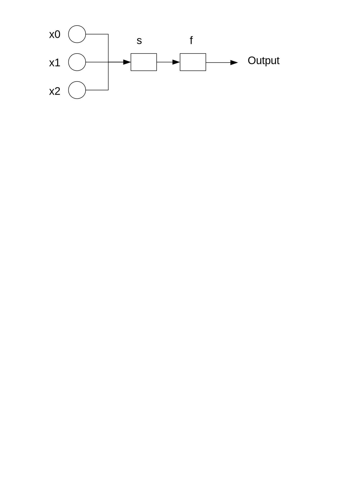
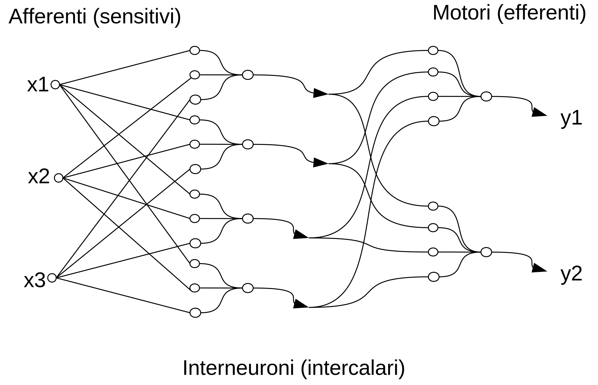

# percettrone 
(Codice dal testo [Introduzione alle reti neurali con esempi in linguaggio C](https://www.amazon.it/dp/1719818738/))

Il percettrone è l'elemento base delle reti neurali supervisionate. E' stato introdotto da Rosenblatt nel 1958

Più percettroni possono essere combinati insieme formando una rete. La rete viene detta rete neurale per il fatto che il percettrone è la rappresentazione astratta di un aspetto della fisiologia dei neuroni.

Se la rete neurale è composta da un solo strato di percettroni, allora il sistema sarà capace di classificare solo input lineramente separabili.

Una rete con uno strato *deep* può classificare anche dei segnali non lineramente separabili.
## Separazione linerare
